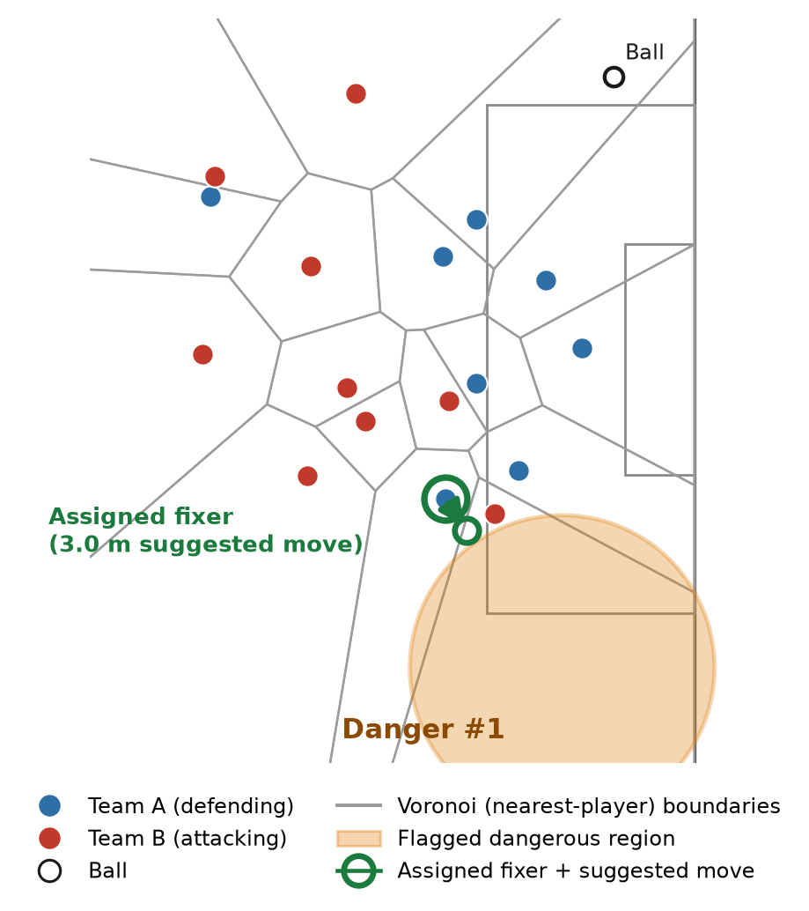
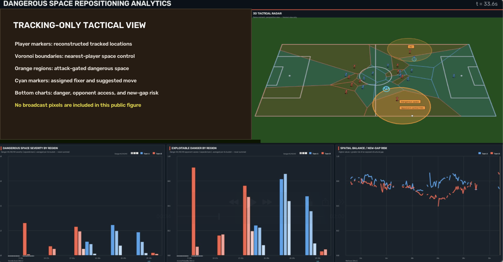

# Closing the Gap

## Attack-Gated Space Control and Bounded Counterfactual Repositioning in Soccer

This project tests whether tracking data can distinguish tactically reachable dangerous space from space that is merely open, identify a plausible defender to close it, and evaluate a small corrective movement without opening another structural gap.

Repository: [https://github.com/RupayanHalder39/MitSloanProblem7_Dangerous_Space_Repositioning_Football](https://github.com/RupayanHalder39/MitSloanProblem7_Dangerous_Space_Repositioning_Football)

## Research Question

Can we identify space that is not merely geometrically open, but relevant to the current attack, and then identify which defender could realistically move to reduce that danger without creating another gap?

## Why This Matters

A coach can often see open space. The harder questions are whether the opponent can exploit it now, which player should close it, how far that player should move, and whether fixing one gap creates another. This research turns those questions into an inspectable decision-support workflow. It does not claim causal match effects or universal tactical optimality.

## Research Pipeline

```text
Broadcast video -> player and ball tracking -> pitch coordinates
-> Voronoi space control -> attacking-team estimate
-> current-attack eligibility gate -> dangerous-region scoring
-> candidate-fixer selection -> bounded <=3 m counterfactual search
-> new-gap check -> coach-facing recommendation
```

## Study Data

The study uses one 120-second, single-camera broadcast segment tracked at 30 fps, giving 3,600 frames. Match-level source footage, tracking, calibration, and row-level derived data are not distributed because their redistribution authorization is not established.

## Dangerous-Space Model

Each opponent-owned Voronoi cell is scored using an area-gated weighted sum:

- goal proximity: 0.20
- centrality: 0.10
- ball proximity: 0.15
- receiver support: 0.20
- coverage gap: 0.35

These are research proxies, not calibrated probabilities.

## Attack Eligibility Gate

Geometric openness is not enough. A causal estimator uses the current frame and 4-second, 12-second, and 30-second trailing windows to estimate the attacking team. A candidate region must align with the live attack, remain within 5 m behind the ball's longitudinal progress, and be reachable within 30 m or supported above the 0.15 receiver threshold. Regions behind the attack, generated while the defending team has possession, or lacking reliable context are excluded from the primary recommendation.

Up to three regions survive centroid/radius de-duplication. Candidate fixers are compared using proximity, feasibility, abandonment cost, and local support.

## Counterfactual Repositioning

The system evaluates a single player's local grid and direct steps toward the flagged region, bounded to 3 m. Each candidate trades danger removed against new-gap risk, structural damage, and movement cost. The result is only the best candidate within the tested local search, never a global optimum.

## Main Findings

- Across a 475-frame audit, strongly-behind primary selections fell from 4.8% to 0.0%, while ahead-of-ball or level selections rose from 53.3% to 64.4%.
- Eligible primary danger was resolved in 21.9% of frames; 64.8% were possession/ball uncertain and 13.3% had known context but no eligible candidate.
- In a 601-frame demo segment, 48 frames resolved a primary region: 44% contained three distinct regions, 48% contained two, and 8% contained one. De-duplication merged overlaps in 47 of 48 cases.
- Only three frames in the full 3,600-frame scan produced a genuinely improving bounded reposition.
- In the illustrated frame-2233 case, a 3.0 m move reduced flagged-region severity by 0.00775 with zero new-gap penalty, producing net benefit +0.01326.

The validated values are recorded in [results/tables/verified_summary.csv](results/tables/verified_summary.csv).

## Figure 1 - Counterfactual Repositioning



At 74.4 seconds, the top-down view shows both teams, the ball, nearest-player Voronoi boundaries, the flagged orange region, and the assigned fixer's suggested 3.0 m move. This is an illustrative positive case, not a typical frame or proof of optimality.

## Figure 2 - Coach-Facing Analytics



The public-safe dashboard replaces the recognizable match frame with an explanatory tracking-only panel. The 3D tactical radar and derived charts retain the audited analytical meaning: regional danger, opponent access, and spatial-balance/new-gap risk. No broadcast pixels are included.

## Practical Use

The framework may support opposition scouting, training-ground rehearsal, and post-match review by making the proposed defender, movement, and trade-offs inspectable. Competitive advantage or real-match improvement has not been validated.

## Video Demonstrations

Two generated dashboard videos were audited: a 120-second full render and a 20-second excerpt. Both contain recognizable broadcast imagery and are withheld because redistribution authorization has not been established. Neither is present in this repository.

## Reproduction

```bash
python -m venv .venv
source .venv/bin/activate
pip install -r requirements.txt
export PYTHONPATH="$PWD/src"
pytest -q
python scripts/validate_public_package.py
```

Full match reproduction requires the lawful inputs described in [data/README.md](data/README.md). The public package supports conditional reproducibility: code, tests, figures, paper, and aggregate results are available, while restricted match inputs are not.

## Data Availability

Included: project code, tests, final paper, public-safe figures, and aggregate validated results.

Excluded: broadcast footage, tracking parquet, ball trajectory, homography transformers, frame-level and row-level derived datasets, and broadcast-derived videos. No data license is claimed for excluded material.

## Limitations

- One match and one 120-second segment.
- Single-camera broadcast tracking limitations.
- Bounded, single-player search rather than multi-player or global optimization.
- Severity and access scores are unvalidated proxies, not probabilities.
- No causal or match-outcome claims.
- Only three improving bounded cases in the full scan.
- Multi-match and practitioner-adjudicated validation remain necessary.

## Paper

- [Final paper PDF](paper/Closing_the_Gap_MIT_Sloan_Public_Final.pdf)
- [Final editable DOCX](paper/Closing_the_Gap_MIT_Sloan_Public_Final.docx)

## Researcher


### Rupayan Halder

- PhD Student - Jadavpur University, Kolkata
- Football AI Researcher
- Assistant Professor - University of Engineering & Management (UEM), Kolkata
- Research Collaborator - SoccerSolver
- Former Software Engineer - Platform Engineering - Session AI

Rupayan's research interests focus on applying artificial intelligence, machine learning, data analytics, and computational methods to real-world problems in football, including player performance analysis, recruitment, transfer-market decision-making, and sporting strategy.

## Connect

- GitHub: [RupayanHalder39](https://github.com/RupayanHalder39)
- LinkedIn: [rupayan-halder-962922209](https://www.linkedin.com/in/rupayan-halder-962922209/)
- Email: rupayanhalder313239@gmail.com

## Research Collaboration


This research was developed in collaboration with SoccerSolver. SoccerSolver currently works with more than 10 football clubs.

## Citation

Provisional citation metadata is provided in [CITATION.cff](CITATION.cff). Rupayan Halder is confirmed; the complete author list is not finalized.

## License

Project-controlled code is available under the scoped [MIT License](LICENSE). See [NOTICE.md](NOTICE.md) for exclusions and [the retained Roboflow notice](docs/THIRD_PARTY_ROBOFLOW_SPORTS_LICENSE.txt) for vendored sports helpers. The code license does not cover footage, data, datasets, the researcher photograph, or the SoccerSolver logo.
